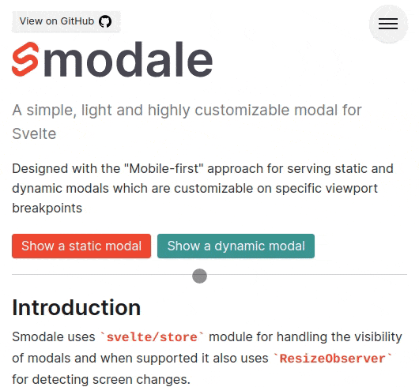

# Smodale

> A simple, light and highly customizable modal for Svelte

Designed with the "Mobile-first" approach for serving static and dynamic modals which are customizable on specific viewport breakpoints

<br />
<div align="center">
  
</div>

## Documentation

Project documentation is available at [smodale.vercel.app](https://smodale.vercel.app/)

## Install

```bash
npm i -S smodale
```

## Quick look

An example of dynamic modal usage. For more use cases check the documentation.

**App.svelte**

```html
<script>
  import smodale from 'smodale';
  import MyCustomModalContent from 'MyCustomModalContent.svelte';

  smodale
    .show(MyCustomModalContent, { text: 'Lorem ipsum' })
    .then((data) => {
      console.log(data); // { foo: 'bar' }
    })
    .catch((error) => {
      console.log(error.message); // 'Something went wrong'
    });
</script>
```

**MyCustomModalContent.svelte**

```html
<script>
  import { getModalContext } from 'smodale';

  const { hide, cancel } = getModalContext();

  export let text = '';

  const onCancelClick = () => cancel(new Error('Something went wrong'));
  const onOkClick = () => hide({ foo: 'bar' });
</script>

<button on:click="{onCancelClick}">Cancel</button>
<button on:click="{onOkClick}">Ok</button>
```

## Development

```bash
git clone https://github.com/smoglica/smodale.git
npm i && npm run dev
```
